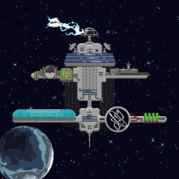

# What is Lootopia?

> We have to start on October 26th 2021, when <a href="https://twitter.com/TheMoonMidas">@TheMoonMidas</a> airdropped the entire total supply of SDOLLAR (15,240,278.55) to SpaceLoot holders. SDOLLAR is a CW20 token native to the Terra blockchain. To ensure a fair and decentralized distribution a cubic root formula was used. The airdrop did not include any team allocations or presales. No more will ever be minted.

In the coming months people gathered around this fact and the DAO (The Society) was formed. Various NFTs have been created and dropped (Character sheets, Weapons, Lootopians, and Lootopian items). We also entered into partnerships with the Knowhere.art marketplace (sold NFTs using our currency, SDOLLAR) and TerraFloki (using their solution, 'NFT as a service').
 
 

## Our Many Names
  
 - <b>Space Dollar</b> is the general currency of The Society, used for minting NFTs and for membership 
  
 - <b>The Society</b> is our Discord community and DAO, where all the magic happens. Join us: <a href="https://discord.gg/">https://discord.gg/</a> 
  
 - <b>Lootopia</b> is the brand of the broader ecosystem that we are adding "legoblocks" to. 
  
 

## SpaceLoot History

> There is no Lootopia without SpaceLoot.
 
SpaceLoot was the first NFT minted on the Terra network in early September, released on the team's later to be marketplace, Knowhere.art! They were so early (before Columbus-05), that the CW721 standard didn't exist yet. That is why you don't see SpaceLoot listed on other marketplaces, a wrapper contract would be required for compatibility.
 

There are 8001 text representations of spaceships, with the option to mint a 2D image of it. Currently you can stake a maximum of four of your ships to receive scraps(90%) and terranite(10%) every 24 hours. This material is intended to be used for upgrading ships and crafting items.

> Since the Knowhere.art team is mostly focusing on their marketplace, The Society inherited the task of building on top of their legacy, which we welcomed :)

**SpaceLoot #2597**

> There seem to be rumors about SpaceStations!

 

Visit Knowhere.art collection: [https://knowhere.art/collections/terra13qrc9j00lk3x0rvpptzdmwtckfj64d5g6xnrv9](https://knowhere.art/collections/terra13qrc9j00lk3x0rvpptzdmwtckfj64d5g6xnrv9) 
Check out the official SpaceLoot website: [https://spaceloot.xyz](https://spaceloot.xyz)

## Partnership with TerraFloki 

Terrafloki Labs are a bunch of Terra enthusiasts like we are, aiming to expand the ecosystem. So far they created:

 - a deflationary token (TFLOKI)
 - a DEX for liquidity
 - Floki character NFTs
 - marketplace
 - staking
 - NaaS, NFT as a subscription model

In order for people to buy tokens like SDOLLAR a so called pool is required, in this case SDOLLAR-UST. Users can add some UST to the pool, and the same amount worth in SDOLLAR. From these pools people can take out one and give back the other, effectively making a trade. During the process the price of the assets change (there will be more of one and less of the other in the pool) as the ratio changes.

Why is this good?

You are helping in growing the liquidity pool, so that individual trades have less affect on the price (the change in ratio is much much smaller). As a reward, the fees of the swaps get equally distributed between the providers in relation to their stake in the pool.
 
> On the TerraFloki DEX you can provide liquidity and therefore swap SDOLLAR-UST. More interestingly you can stake SDOLLAR-LP tokens. When you allocate to a pool you get a token back in exchange, kind of like a receipt. If you have this receipt you can trade it back for your funds any time. By locking up these LP tokens you start to accumulate tickets over time. You can mint NFTs using the tickets.

There has been two farming events so far:

 - SpacePets
 - Lootopian items

> You can decide to finish farming, and take out your liquidity any time, there is no lockup period.

More information on the TerraFloki website: [https://terrafloki.io](https://terrafloki.io)

## Collab with Stargazers

The Stargazers team consists of 3 Cosmos network enthusiasts. They say this about themselves:

"With all the in-fighting going in the Cosmoverse we want to unite the banners of the ecosystem and help bring together the communities! Our focus is creating a collection of generative NFT banners designed to celebrate and promote the Cosmos ecosystem!"

We also appreciate the Cosmos SDK, and think interoperability between chains is natural evolution of blockchains. We believe our ideas and work is stronger as a group of projects than individual ones fighting for the top. Therefore we appreciated it greatly, when they created a 1/1 custom NFT for us as part of their collection, this is the banner you see on this site!

Check out their website: [https://www.stargazersnfts.io/](https://www.stargazersnfts.io/)
