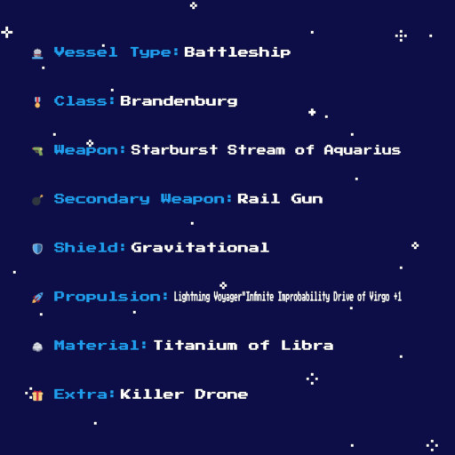
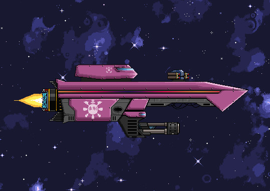

# Lootopia NFTs

> We have released several NFT collections, or as we like to call them, legoblocks of the Lootopia metaverse.

## Character sheet

Character sheets define certain basic aspects of your Lootopian.

 - **Name:**  a must have in civilized societies
 - **Origin:**  do you have hands or tentacles?
 - **Profession:**  are you an athlete or a religious leader?
 - **Obsession:**  seems to be your driving force, immortality is quite popular I hear
 - **Talent:**  where you really shine..
 - **Skill:**  hold my beer!
 - **Alignment:**  because you always need a chaotic neutral in the group

So much variety, did you know there are 75 professions? :eyes:

Total supply: 2000 

Here is one:

**Marketplace:**

[https://knowhere.art/collections/terra1q7jnhm5ju8zqua47yu3007879jncevt9ev4kk6](https://knowhere.art/collections/terra1q7jnhm5ju8zqua47yu3007879jncevt9ev4kk6) 
[https://randomearth.io/collections/terra1q7jnhm5ju8zqua47yu3007879jncevt9ev4kk6](https://randomearth.io/collections/terra1q7jnhm5ju8zqua47yu3007879jncevt9ev4kk6)

## Weapons

Protection is very important in Lootopia, and a must in certain lines of work!

Weapons come in a huge variety as well, from material to ammo type.

 - **Name:**  in Lootopia, almost everything has a name..
 - **Rarity**  certain models are much harder to come by
 - **Material**  how will I get my hand on that sweet Unobtanium?
 - **Weapon type:**  what are you aiming for?
 - **Ammunition type:**  one of these will get the job done
 - **Damage dealt** are you seeing stars yet?
 - **Range**  if only you would come a bit closer!
 - **Fire rate**  reloading.
 - **Special property:** now you could not have expected a gravitational pulse

Total supply: 4000

Here is one:

**Marketplace:**

[https://knowhere.art/collections/terra1q7a0c3zg77s67ep8ygs9jfsk0p2ymvt5xjr3ad](https://knowhere.art/collections/terra1q7a0c3zg77s67ep8ygs9jfsk0p2ymvt5xjr3ad)

## Lootopians

Lootopians are avatars representing you in the metaverse. They have stats and you can equip items to customize them. They have the following traits:

 - **Date of birth**
 - **Level**
 - **XP**
 - **CLass**
 - **Body**
 - **Eyes**
 - **Hair**
 - **Strength**
 - **Vitality**
 - **Agility**
 - **Intelligence**
 - **Luck**
 - **Dexterity**

Total supply: 1000

Here are a few:

**Marketplace:**

[https://knowhere.art/collections/terra1tehe2e4ufa9n0xeef4wxvfvhncjyzetlp404wm](https://knowhere.art/collections/terra1tehe2e4ufa9n0xeef4wxvfvhncjyzetlp404wm) 
[https://randomearth.io/collections/terra1tehe2e4ufa9n0xeef4wxvfvhncjyzetlp404wm](https://randomearth.io/collections/terra1tehe2e4ufa9n0xeef4wxvfvhncjyzetlp404wm)

**Rarity guide**

[https://tinyurl.com/LootopiansRarityGuide](https://t.co/bQWFPipcOx)

## Lootopian Items

Lootopian items have a mint date and a quality trait. The quality goes like this:

 - **Common**
 - **Uncommon**
 - **Rare**
 - **Epic**
 - **Mythic**
 - **Legendary**

Total supply: 5600 but constantly growing with new mints :)

Here is a set from the marketplace:

**Marketplace**:

[https://randomearth.io/collections/terra1gx478xey87dq3dz2sfdt6rfcd0snqpj83ypd3x](https://randomearth.io/collections/terra1gx478xey87dq3dz2sfdt6rfcd0snqpj83ypd3x)

## Spacepets

Or should I say, Space Eggs at this point! These creatures, whatever they might be in the end, will surely be a nice companion to follow you along your journey.

Spacepets vary in their **Element** and  **Size**.

Here are the fire, water, earth and wind eggs:

Total supply: 3200

**Marketplace**:

Click the **Launchpad** on the left: [https://terrafloki.io/marketplace/](https://terrafloki.io/marketplace/)

## SpaceLoot

SpaceLoot are text representations of spaceships.

**Traits**

 - **Vessel**
 - **Class**
 - **Weapon**
 - **Secondary weapon**
 - **Shield**
 - **Propulsion**
 - **Material**
 - **Extra**

Total supply: 8001

**#2597**

**2D art can be minted for your ships, here is how #2597 turned out:**

**Marketplace**:

[https://knowhere.art/collections/terra13qrc9j00lk3x0rvpptzdmwtckfj64d5g6xnrv9](https://knowhere.art/collections/terra13qrc9j00lk3x0rvpptzdmwtckfj64d5g6xnrv9)

**Rarity guide**

[SpaceLoot rarity](https://app.appsmith.com/applications/615055e218a27e5288afae00/pages/6189ab64799de8559acc56d4)

## SpaceLoot Staking

You can stake one to four of your SpaceLoots to receive either **Scraps** or the more rare **Terranite** ore daily! Although exact utility is not yet defined, rest assured it will be used for crafting, upgrades, repairs, and so on :) You have 10% chance of hitting Terranite and 90% for Scraps for each of your staked ship.

Use the v2 staking site on [Knowhere.art](https://v2.knowhere.art/metaverse/terra13qrc9j00lk3x0rvpptzdmwtckfj64d5g6xnrv9/staking) to stake your ships. 

> Unfortunately the fee for claiming the rewards is quite hefty if you do it on KA! However there is a workaround.. Follow our [guide](linktoguide) to shrink that fee to 1/10th of the original cost, to around 0.07 UST per transaction!

> Staking was meant to be for a limited time only, once you will be able to send ships on missions, the current form of staking will end.

