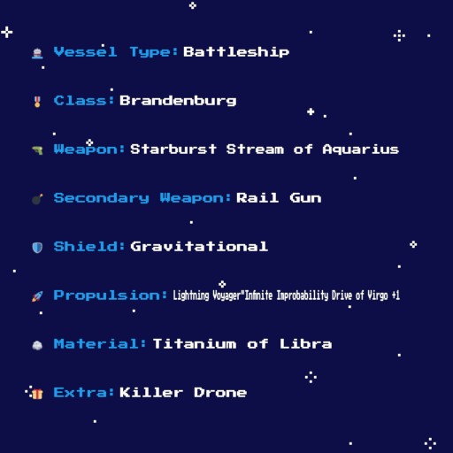
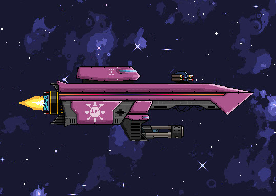

# What is Lootopia?

> We have to start on October 26th 2021, when <a href="https://twitter.com/TheMoonMidas">@TheMoonMidas</a> airdropped the entire total supply of SDOLLAR (15,240,278.55) to SpaceLoot holders. To ensure a fair and decentralized community distribution a cubic root formula was used. The airdrop did not include any team allocations or presales. No more SDOLLAR will ever be minted.

In the coming months the DAO was formed (The Society), various NFTs have been created and dropped (Character sheets, Weapons, Lootopians, and Lootopian items), we created partnerships with Knowhere.art (sold NFTs using our currency, SDOLLAR) and Tfloki (using their solution, 'NFT as a service').
 
 

# Our Many Names
  
 - <b>Space Dollar</b> is the currency used for minting NFTs and t will be rewarded for quests 
  
 - <b>The Society</b> is our Discord community and DAO, where all the magic happens. Join us: <a href="https://discord.gg/">https://discord.gg/</a> 
  
 - <b>Lootopia</b> is the brand of the broader ecosystem that we are adding "legoblocks" to. 
  
 

# SpaceLoot History

 
SpaceLoot was the first NFT minted on the Terra network in early September, released on the team's later to be marketplace, Knowhere.art! They were so early (before Columbus-05), that the CW721 standard didn't exist yet. That is why you don't see SpaceLoots listed other marketplaces, a wrapper contract would be required for compatibility.
 

There are 8001 representations of spaceships, with the option to mint a 2D image of it. Currently you can stake four of your ships to receive scraps and terranite every 24 hours.

> SpaceLoot #2597

> There seem to be rumors about SpaceStations!

 

Visit Knowhere.art collection: [https://knowhere.art/collections/terra13qrc9j00lk3x0rvpptzdmwtckfj64d5g6xnrv9](https://knowhere.art/collections/terra13qrc9j00lk3x0rvpptzdmwtckfj64d5g6xnrv9)

Check out the official SpaceLoot website: [SpaceLoot.xyz](https://spaceloot.xyz)  

# Partnership with TerraFloki 

Terrafloki Labs are a bunch of Terra nerds like we are aiming to expand the ecosystem. So far they created:

 - a deflationary token (TFLOKI)
 - a DEX for liquidity
 - Floki character NFT
 - marketplace
 - staking
 - NaaS, NFT as a subscription model

> On the TerraFloki DEX you can provide liquidity and therefore swap SDOLLAR-UST. More interestingly you can stake SDOLLAR and LP tokens. Tickets are rewarded through a "farming period", which you can claim NFTs with.

There has been two farming events so far, both for LLP:

 - SpacePets (finished)
 - Lootopian items (ongoing till 12th May)

Learn more about TerraFloki on their website: [TerraFloki.io](https://terrafloki.io)
